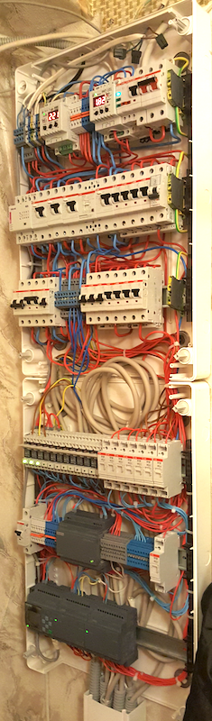

# Smart home based on SIEMNS LOGO! smart relay
I use Siemens LOGO! relay for my smart home instalation.

Main logical module with ethernet connector [6ED1052-1HB00-0BA8](https://mall.industry.siemens.com/mall/en/us/Catalog/Product/6ED10521HB000BA8)

24v DC power supply [6EP1332-1SH52](https://mall.industry.siemens.com/mall/en/ww/Catalog/Product/6EP1332-1SH52) 

2 8DI/8DO extension modules [6ED10551NB100BA2](https://mall.industry.siemens.com/mall/en/us/Catalog/Product/6ED1055-1NB10-0BA2)

To control light [ABB CR-P024AC1 1SVR405600R0000](http://new.abb.com/products/1SVR405600R0000/cr-p024ac1-pluggable-interface-relay-1c-o-a1-a2-24vac-250v-16a)

To control wall sockets blocks [ABB EN20-20 GHE3221101R0006](http://new.abb.com/products/GHE3221101R0006/en20-20-230v-50hz-installation-contactor)



To connect Siemens LOGO! with smart home servers like Home assistant, Majardomo and so on I use MQTT server and simple python polling application.

Home assistant configuration example:
```
light:
  - platform: mqtt
    name: "Bedroom"
    state_topic: "siemens/logo/0/status"
    command_topic: "siemens/logo/0/switch"
    payload_on: "on"
    payload_off: "off"
    optimistic: false
  - platform: mqtt
    name: "Kitchen"
    state_topic: "siemens/logo/1/status"
    command_topic: "siemens/logo/1/switch"
    payload_on: "on"
    payload_off: "off"
    optimistic: false
  - platform: mqtt
    name: "BathRoom"
    state_topic: "siemens/logo/2/status"
    command_topic: "siemens/logo/2/switch"
    payload_on: "on"
    payload_off: "off"
    optimistic: false
```


